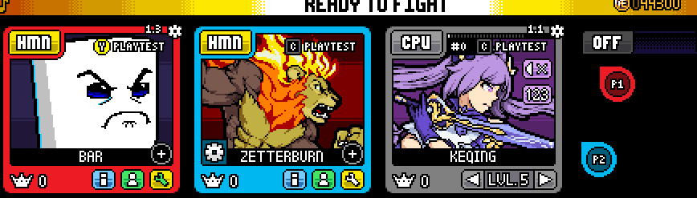

# Supersonic's CSS CPU Toggle Helper

<p align="center"> 
    </img>
</p>

[(Keqing Mod by Bar-Kun.)](https://steamcommunity.com/sharedfiles/filedetails/?id=2786885695)

## Features

- Allows you to use the CSS input variables from another player as a CPU
- Works with any code already utilizing `cursor_id`

## Installation

1. [**Download the portrait outline sprite from here and put it in your sprites folder.**](https://drive.google.com/uc?export=download&id=1xgI92GjiiGxiPSzHy8KAxSSK38wREcBD)

2. Paste the following code into `css_init.gml`:

    ```gml
    cpu_hover_init(); //put this anywhere above your #defines

    //as always, #defines go at the bottom of the script.
    #define cpu_hover_init()
    cpu_hovering_player = -1; //the current player that's hovering the cpu. -1 for nobody
    cpu_is_hovered = -1; //whether the cpu is hovered currently.
    cpu_hover_time = 0; //the timer for the cpu hover indicator
    cpu_color_swap_time = 0; //the timer for the cpu indicator's smooth color swap
    cpuh_prev_color = c_gray;
    cpuh_new_color = c_gray;

    var c = [-4,-4,-4,-4,-4];
    with (asset_get("cs_playercursor_obj")) { //this sets the cursor array
        c[get_instance_player(self)] = self;
    }
    cursors = c;

    x = floor(x); //hehe
    y = floor(y);
    plate_bounds = [x,y,x+219,y+207]; //boundaries of the player plate
    portrait_bounds = [x+10,y+10,x+210,y+151]; //boundaries of the player portrait. unused but useful
    cpu_hover_sprite = sprite_get("cpu_controllingplayer_outline"); //the outline sprite.
    ```

3. Paste the following code into `css_update.gml`:

    ```gml
    cpu_hover_update(); //put this at the VERY TOP of the file.

    //as always, #defines go at the bottom of the script.
    #define cpu_hover_update()
    var p = player;
    var is_cpu = (get_player_hud_color(p) == 8421504);

    if (is_cpu) {
        var pb = plate_bounds, cs = cursors;
        if (cpu_is_hovered) {
            var c = cs[@cpu_hovering_player]
            cursor_id = c;
            var cx = get_instance_x(c),
                cy = get_instance_y(c);
            if (cpu_hover_time < 10) cpu_hover_time++;
            if (cpu_color_swap_time < 5) cpu_color_swap_time++;
            if (cx != clamp(cx, pb[0],pb[2]) || cy != clamp(cy, pb[1],pb[3])) {
                cpu_is_hovered = false;
                c = cs[@p];
                cursor_id = c;
            }
        } else {
            var hplayer = get_new_hovering_player();
            if (cpu_hover_time > 0) cpu_hover_time--;
            if (hplayer != -1) {
                cpuh_new_color = get_player_hud_color(hplayer);
                if (cpu_hover_time > 0) {
                    cpuh_prev_color = get_player_hud_color(cpu_hovering_player);
                    cpu_color_swap_time = 0;
                } else { //if the player indicator is not being displayed already
                    cpuh_prev_color = cpuh_new_color;
                    cpu_color_swap_time = 10;
                }
                cpu_is_hovered = true;
                cpu_hovering_player = hplayer;
                cursor_id = cs[@hplayer];
            }
        }
    } else {
        cpu_is_hovered = false;
        cpu_hover_time = 0;
        cursor_id = cursors[player];
    }

    #define get_new_hovering_player()
    var pb = plate_bounds, cs = cursors;
    for (var i = 1; i <= 4; i++) {
        var c = cs[@i];
        var cx = get_instance_x(c);
        var cy = get_instance_y(c);
        if cx == clamp(cx, pb[@0], pb[@2]) && cy == clamp(cy, pb[@1], pb[@3]) {
            return i;
        } 
    }
    return -1;
    ```

4. Paste the following code in `css_draw.gml`:

    ```gml
    cpu_hover_draw(); 
    // you can put this anywhere above your #defines.
    // i would recommend ending the shader first (shader_end();)

    //as always, #defines go at the bottom of the script.
    #define cpu_hover_draw()
    if (cpu_hover_time > 0) {
        var prog = min(cpu_hover_time/10, 1);
        var colprog = min(cpu_color_swap_time/5, 1);
        var col = merge_color(cpuh_prev_color, cpuh_new_color, colprog);
        draw_sprite_ext(cpu_hover_sprite, 0, x - 4, y - 6, 2, 2, 0, col, prog);
        draw_set_alpha(prog);
        draw_debug_text(plate_bounds[2]-17, plate_bounds[3]+1, `P${cpu_hovering_player}`);
        draw_set_alpha(1);
    }
    ```

And you're done! The input variables should now work when you hover over a CPU playing as your character, and `cursor_id` should be the player that is currently hovering the cpu slot.

## Known Issues

- This system does not work at all on teams.
  - Currently, this can't be fixed. The only way to detect a CPU on CSS is via the HUD Color, which is different when playing teams. To work around this, turn off teams and do what is needed, then turn teams back on.
