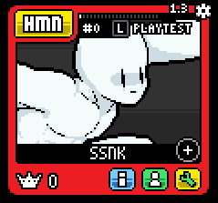

# Supersonic's Nametag Alt Palettes

<p align="center"> 
    </img>
</p>

## Features

- Only uses one bit in synced var
- Easily add alts to nametags
- Toggle whether to use the nametag alt on CSS

## Installation

1. [**Download the user event here**](https://github.com/SupersonicNK/roa-workshop-templates/raw/master/nametag-alts/scr/user_event12.gml) and place it in your `scripts` folder. (You can change the number of the user event.)

2. In that file, in `#define define_colors()`, find the `shade_count` variable. Set it to the number of shade slots your character has, to prevent crashing the game. You can also do a couple other customizations here, if desired.

3. [**Get the CSS Button's sprite here**](https://drive.google.com/uc?export=download&id=13eRsR0Cwmgq5ac0ap8EEyhZPqwUDeZwl) and place it in your `sprites` folder.

4. In `css_update.gml`, add the following code:

    ```gml
    // whether the tag palette is on. this variable is for your synced var.
    // IMPORTANT: The 12 (first argument) in this function should be the same number as the user event.
    tag_pal_on = player_tag_palettes(12); 
    // the current alt, even with a tag palette equipped.
    // just in case you want to support it in your css script somehow.
    cur_tag_pal = tag_pal_on ? ssnk_tagpal.active_clr : get_player_color(player);

    // please see 
    // https://github.com/SupersonicNK/roa-workshop-templates/tree/master/generate-synced-var 
    // for more info on this function. it helps have multiple values in your synced variable.
    var syncvar = generate_synced_var( 
        tag_pal_on, 1 
        );

    set_synced_var( player, syncvar ); 

    // As usual, #defines all go at the bottom of the script.
    #define player_tag_palettes
    ///(user_event, ?arg)
    __ssnk_tagpal_scr = script_get_name(1);
    __ssnk_tagpal_arg = argument_count > 1 ? argument[1] : 0;
    user_event(argument[0]);
    return "__ssnk_tagpal_res" in self ? __ssnk_tagpal_res : 0;

    // https://github.com/SupersonicNK/roa-workshop-templates/tree/master/generate-synced-var 
    #define generate_synced_var
    ///args chunks...
    ///Given pairs of chunks and their lengths in bits, compiles them into one value.
    //arg format: chunk, bit_length, chunk, bit_length, etc.
    var output = 0;
    var num_chunks = argument_count/2;
    if num_chunks != floor(num_chunks) {
        print("error generating synced var - function formatted wrong.");
        return 0;
    }
    var total_len = 0;
    for (var i = num_chunks-1; i >= 0; i--) {
        var pos = (i*2);
        var shift = (pos-1 >= 0) ? argument[pos-1] : 0;
        total_len += argument[pos+1];
        output = output | argument[pos];
        output = output << shift;
    }
    if total_len > 32 {
        print(`error generating synced var - bit length surpassed 32! (${total_len} bits.)`);
        return 0;
    }
    return real(output);
    ```

    This handles the synced variable, and uses [`generate_synced_var`](https://github.com/SupersonicNK/roa-workshop-templates/tree/master/generate-synced-var) to allow you to add other values to your synced variable.

5. In `css_draw.gml` add the following code:

    ```gml
    // IMPORTANT: The 12 (first argument) in this function should be the same number as the user event.
    player_tag_palettes(12);
    // Ideally, this is above all #defines, but below everything else.

    // As usual, #defines all go at the bottom of the script.
    #define player_tag_palettes
    ///(user_event, ?arg)
    __ssnk_tagpal_scr = script_get_name(1);
    __ssnk_tagpal_arg = argument_count > 1 ? argument[1] : 0;
    user_event(argument[0]);
    return "__ssnk_tagpal_res" in self ? __ssnk_tagpal_res : 0;
    ```

    This allows it to draw the CSS button, located directly next to the player's nametag when a valid name is entered.

6. In `init_shader.gml`, add the following code: 

    ```gml
    // The current alt palette, with a fix for the online CSS.
    var alt_cur = get_player_color((room == 113 && object_index != oTestPlayer) ? 0 : player);

    // Split the synced var. For more info on this function, see:
    // https://github.com/SupersonicNK/roa-workshop-templates/tree/master/generate-synced-var 
    if "__syncvar" not in self __syncvar = split_synced_var(1);
    var tag_pal_value = __syncvar[0]; //change the 0 to the synced var index for the tag palette.
    // IMPORTANT: The 12 (first argument) in this function should be the same number as the user event.
    var tag_pal = player_tag_palettes(12, tag_pal_value);

    // This is your final alt value, which is the current alt palette the player has selected.
    var real_alt = tag_pal != -1 ? tag_pal : alt_cur;

    #define player_tag_palettes
    ///(user_event, ?arg)
    __ssnk_tagpal_scr = script_get_name(1);
    __ssnk_tagpal_arg = argument_count > 1 ? argument[1] : 0;
    user_event(argument[0]);
    return "__ssnk_tagpal_res" in self ? __ssnk_tagpal_res : 0;

    // https://github.com/SupersonicNK/roa-workshop-templates/tree/master/generate-synced-var 
    #define split_synced_var
    ///args chunk_lengths...
    var num_chunks = argument_count;
    var chunk_arr = array_create(argument_count);
    var player = (room == 113) ? 0 : self.player;
    var synced_var = get_synced_var(player);
    var chunk_offset = 0
    for (var i = 0; i < num_chunks; i++) {
        var chunk_len = argument[i]; //print(chunk_len);
        var chunk_mask = (1 << chunk_len)-1
        chunk_arr[i] = (synced_var >> chunk_offset) & chunk_mask;
        //print(`matching shift = ${chunk_len}`);
        chunk_offset += chunk_len;
    }
    print(chunk_arr);
    return chunk_arr;
    ```

    This handles setting the color properly, and provides a means for obtaining the current alt number for shader shenanigans.

## Usage

To add an alt to a nametag, open the `user_event12.gml` (or whatever you changed the 12 to), and in the `#define define_colors()` section, use the `add_named_alt(name, alt)` function as shown:

```gml
add_named_alt("exmple", 32); // This sets the name "exmple" to point to color 32 in colors.gml.
```
