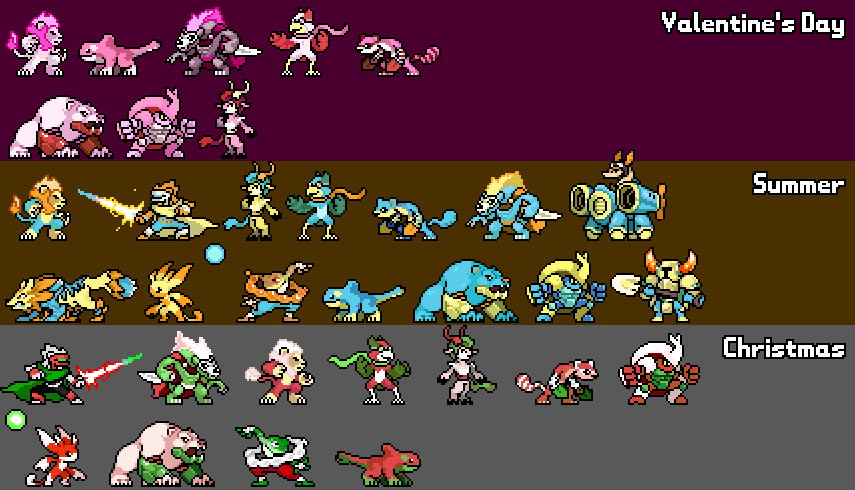

# Automated seasonal skins

As of recent updates, it's now possible to get the current season, even from colors.gml. As such you can now *automate the setting of holiday skins* using the following switch statement.
Simply set up the color as normal from the comment.

Typically, holiday skins are alt 6.
```gml
//colors.gml:
switch (get_match_setting(SET_SEASON)) {
  case 1: // valentines
    //set your valentines holiday alt
    break;
  case 2: // summer
    //set your summer holiday alt
    break;
  case 3: // halloween
    //set your halloween holiday alt
    break;
  case 4: // christmas
    //set your christmas holiday alt
    break;
}
```

Examples of holiday alts (minus Halloween, as that one is based on costumes of various characters instead of following one specific color theme)


